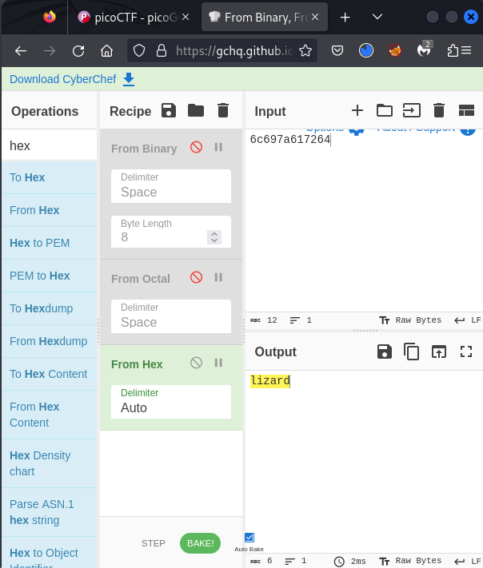

# Based (General Skills)

To solve this challenge we're gonna use CyberChef
https://gchq.github.io/CyberChef/

<b>-></b> nc &lt;host&gt; &lt;port&gt;

the first word is written in <b>binary</b>
 
the second one in <b>octal</b>
and the last one in <b>hex</b>

Flag is: <i>picoCTF{learning_about_converting_values_b375bb16} </i>

