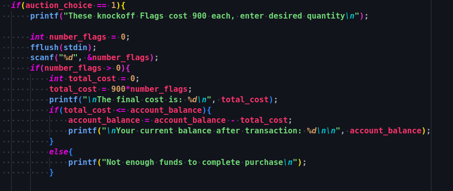
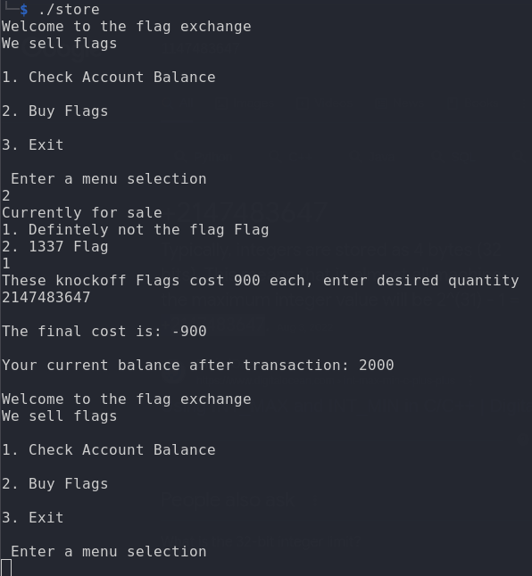
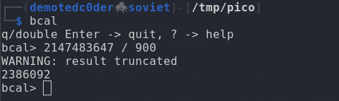
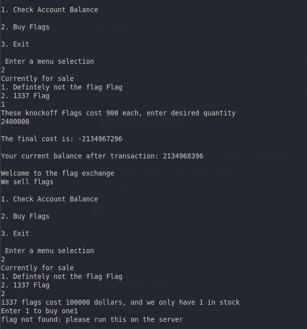
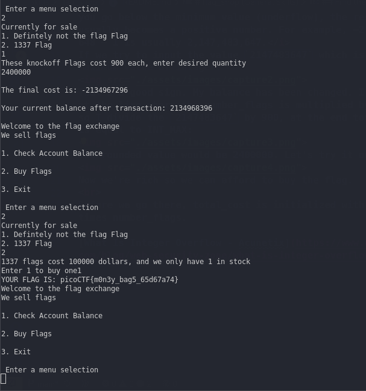

# flag_shop (General Skills)

There's a flag shop selling stuff, can you buy a flag? 
Connect with
`nc <host> <port>`

## Find the flag; Shall we?

First let's take a look at the source code. The program is written in C.
The part where things get interesting is this one 

So, technically the data type is integer (values), account_balance is equal to account_balance - total_cost and there's a way where we can manipulate this operation in order to top up the balance.
In other words this is called `Integer Overflow`

 
<i>When you go above the maximum value of the signed integer, the result usually becomes a negative number. For example, 2,147,483,647 +1 is usually −2,147,483,648. When you go below the minimum value (underflow), the result usually becomes a positive number. For example, −2,147,483,648 − 1 is usually 2,147,483,647.</i>

If we try to input the value `2147483647` which is the maximum value of integer:

That's a good sign. My balance has been changed. I go back at the line where the number_flags is multiplied by 900, so I divide the `2147483647` by 900, at the end total_cost is equal to INT_MAX:

The rounded value would be 2400000. Let's try it out.

Now we're rich so we can afford to buy the flag.

 

<i>YOUR FLAG IS: picoCTF{m0n3y_bag5_65d67a74}</i>

[What Is Integer Overflow - Acunetix](https://www.acunetix.com/blog/web-security-zone/what-is-integer-overflow/)
