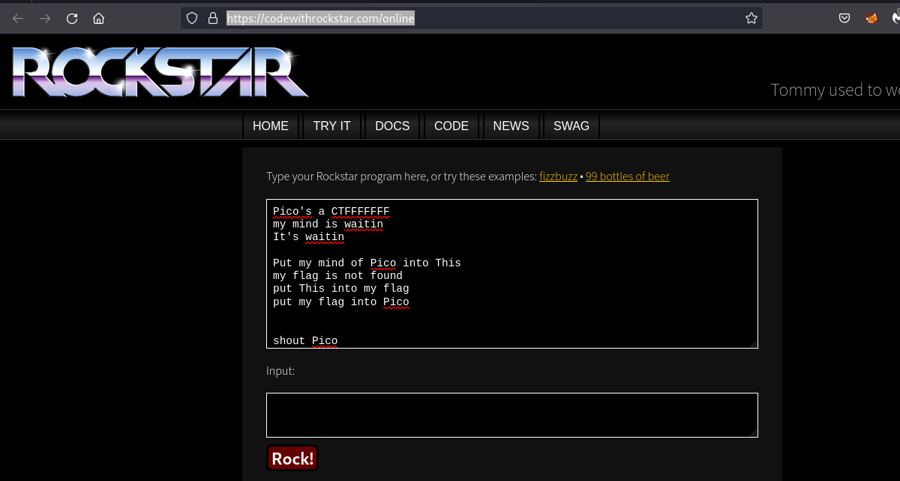
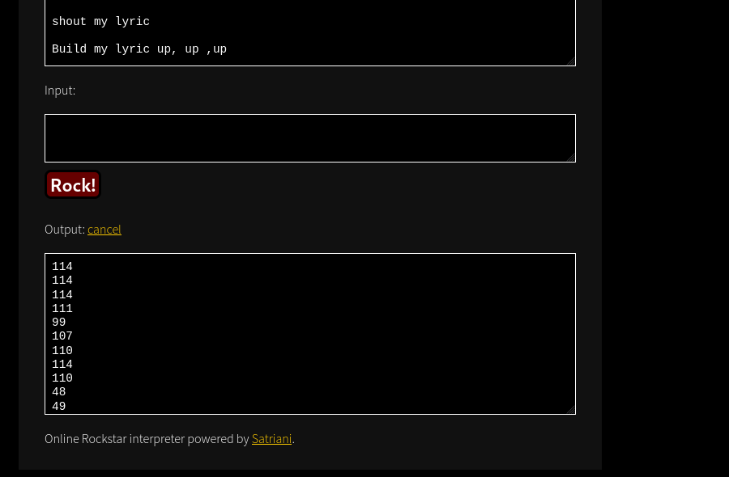

# mus1c (General Skills)

First we need to know what is rockstar (in context of computer science) ?
Rockstar is a dynamically typed computer programming language, designed for creating programs that are also song lyrics.

The lyrics is in the lyrics.txt file.

To solve this challenge we are going to use https://codewithrockstar.com/online

As shown in the image below, paste the lyrics and then click on Rock button.

Save the output in a text file (like I did - out.txt)

Execute the script 'gettheflag.sh'

'The output after you execute the script should be: <b>The flag is: picoCTF{rrrocknrn0113r}</b>'
