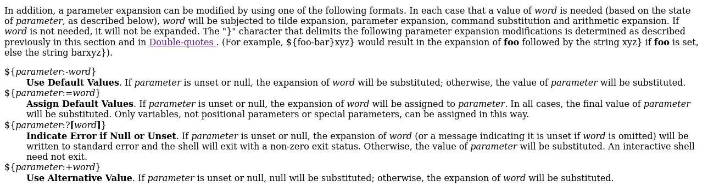

# Special (General Skills)

Don't power users get tired of making spelling mistakes in the shell? Not anymore! Enter Special, the Spell Checked Interface for Affecting Linux. Now, every word is properly spelled and capitalized... automatically and behind-the-scenes! Be the first to test Special in beta, and feel free to tell us all about how Special streamlines every development process that you face. When your co-workers see your amazing shell interface, just tell them: That's Special (TM) Start your instance to see connection details.

## Find the flag; Shall we?

First let's try some well-known commands.

As you can see all the commands are not interpreted correctly. So the reference that is very handy is this one:

[Shell Command Language](https://pubs.opengroup.org/onlinepubs/7908799/xcu/chap2.html)

Basically, what we do here is assigning default values.
In this case the values are commands (which are not defined yet).

digging...

<i>The flag is: picoCTF{5p311ch3ck_15_7h3_w0r57_a60bdf40}</i>
