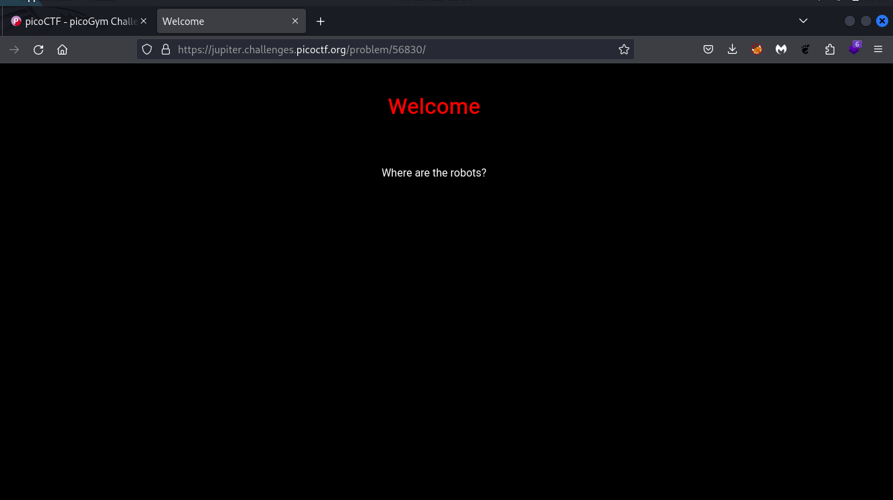
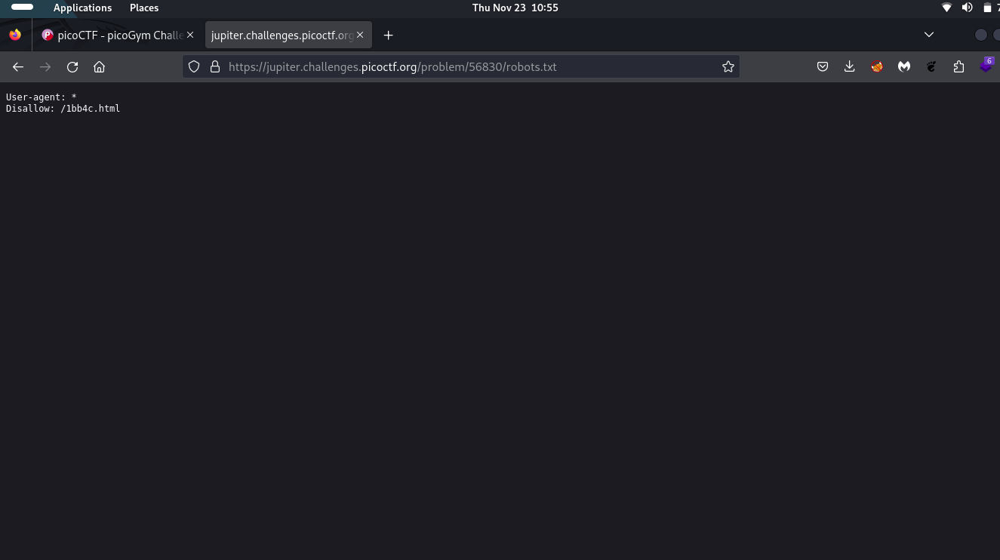
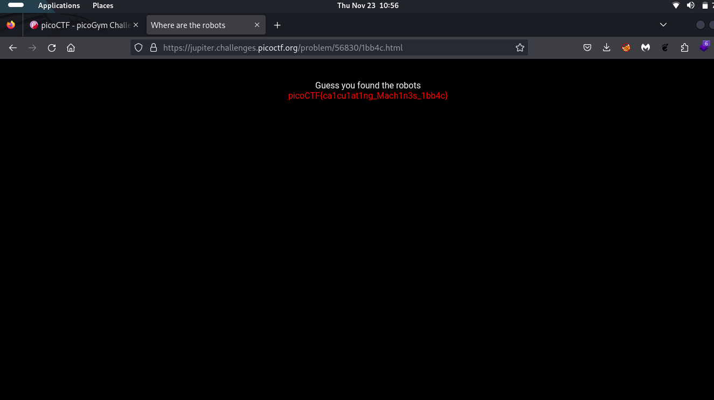

# Where are the Robots

A robots.txt file tells search engine crawlers which URLs the crawler can access on your site. This is used mainly to avoid overloading your site with requests; it is not a mechanism for keeping a web page out of Google.

First lets take a look at the webpage

then try to access robots.txt file

let's see what we get in /1bb4c.html 

<i>The flag is: picoCTF{ca1cu1at1ng_Mach1n3s_1bb4c}

